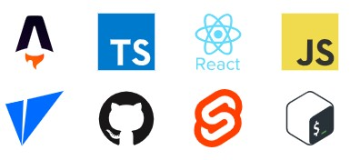

# devicons-astro



A package that provides a component to use icons from the awesome [Devicons](https://devicon.dev/) collection.

## Usage

Install the package.

```bash
npm install devicons-astro
```

Import and use the `DevIcon` component into your `.astro` file.

```astro
---
import DevIcon from 'devicons-astro';
---

<DevIcon name="typescript" variant="original" size={64} />
```

### Props

```ts
import type { HTMLAttributes } from 'astro/types'

const Variants = [
  "original",
  "plain",
  "line",
  "original-wordmark",
  "plain-wordmark",
  "line-wordmark",
] as const;

type ColorObject = {
  bgLight?: string;
  bgDark?: string;
  minContrastDark?: number;
  minContrastLight?: number;
  fallbackDark?: string;
  fallbackLight?: string;
};

interface Props extends HTMLAttributes<"svg"> {
    name: string;
    variant?: (typeof Variants)[number] | Array<(typeof Variants)[number]>;
    size?: string | number;
    responsiveColors?: boolean | ColorObject
}
```

1. Name (required) - The name of the icon to render. Will be the same as you would see it on the [Devicons website](https://devicon.dev).
The component will throw an error if it does not match exactly. All names are lowercase and generally do not have spaces or any other puntuation.
(ie 'Amazon Web Services' is 'amazonwebservices').
2. Variant (optional) - Each `Devicon` has several variants and you can use this to specify which you want (defaults to `["original", "plain", "line"]`). See [Fallbacks](#fallbacks) for more details.
3. Size (optional) - Sets width and height, defaults to 24px.
4. Responsive Colors (optional) - See [Responsive Colors](#responsive-colors) for more details.
5. Any other valid svg props.

## Fallbacks

The component will produce an [error](#errors) whenever an invalid name or variant is passed. You can override this behavior in one of two ways:

### Pass a fallback slot

The `DevIcon` component has one slot, `fallback`. Anything you put in this slot will be rendered instead of the requested icon **only if the requested icon is invalid**.

```astro
<DevIcon name="does-not-exist" variant="who-knows">
    
</DevIcon>
```

No errors will be thrown and the fallback image will be rendered instead.

### Give multiple variant options

This will only work if the requested icon is valid, but if you pass an array of valid variants to the `variant` prop, it will check each variant passed and go to the next if that
icon doesn't have a variant of that type. Example -

```astro
<DevIcon name="typescript" variant={["who-knows", "original", "plain"]} />
```

In this case since `who-knows` is not a valid variant, but `original` is, the `original` variant will be rendered.

## Responsive Colors

**New in v0.3**

Sometimes you may not know if an icon works on a particular background. You can now pass a color object (or just `true`) to the `responsiveColors` prop:

```ts
type ColorObject = {
  bgLight?: string; // Your app's light background color (default - #fff)
  bgDark?: string; // Your app's dark background color (default - #000)
  minContrastDark?: number; // Minimum contrast between dark bg and icon color (defaults to 3 based on WCAG standards - https://webaim.org/resources/contrastchecker)
  minContrastLight?: number; // Default 3
  fallbackDark?: string; // A specified fallback color for dark backgrounds if contrast isn't reached (default - #fff)
  fallbackLight?: string; // Default #000
};
```

Internally the component uses the [`colorjs.io`](https://colorjs.io) package, so you can pass any valid color string that is accepted by the `Color` class (pretty much any valid CSS color string).

When this option is in effect, the colors will change based on the user's `prefers-color-scheme` selector.

> **Important Note**
>
> Most of the icon's `original` variants use multiple colors and/or textured/gradient backgrounds. Because of this, using responsive colors on these variants will most likely
> not produce the desired effect. Use the `plain` or `line` variants instead.

## Design/Caching

Because of the sheer number of icons (over 2000 variants), `devicons-astro` does not include built components but instead
pulls directly from the `jsdelivr` cdn at build time to minimize package size. An svg icon is generated as a result and passed to the `DevIcon` component.

While this is fine and efficient during build time (as the icon will only be fetched once), this does cause many queries to happen during development.
To minimize this impact, `devicons-astro` caches the result locally so it can be reused. When developing, you should only fetch the icon from the cdn once and reuse the
result from then on.

## Errors

Since there are many variations, `devicons-astro` attempts to provide some helpful errors to point you in the right direction when you pass invalid values:

```astro
<DevIcon name="nothing">
// Devicons does not contain the icon 'nothing'. Please see https://devicon.dev for all icons
<DevIcon name="typescript-original">
// You have likely included the variant type with the name. Pass the variant to the 'variant' prop separately instead (ie name="typescript" variant="original")
<DevIcon name="python" variant="line-wordmark">
// Devicon 'python' does not have a variant 'line-wordmark'. Valid variants: 'original, original-wordmark, plain, plain-wordmark'
```

To avoid this behavior, see [Fallbacks](#fallbacks).
